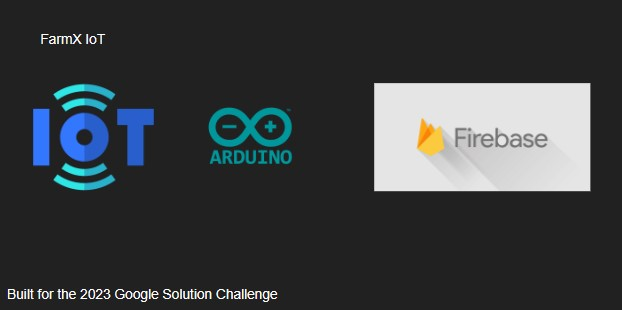
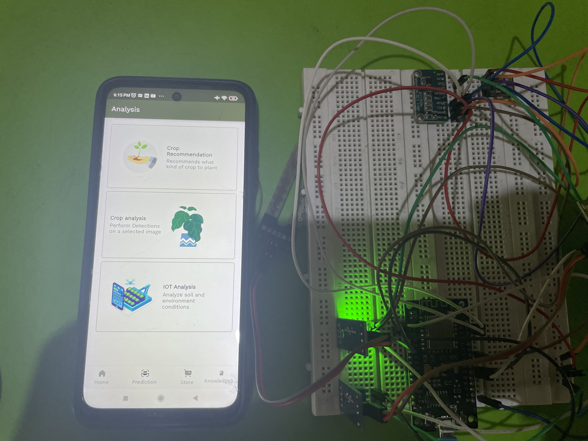

# FarmX IoT Device

The farmX IoT Device is designed to monitor environmental parameters for farming purposes. This README provides an overview of the project, its features, hardware setup, and instructions for getting started.

## Google Solution Challenge 2023

The farmX IoT device was developed for the Google Solution Challenge 2023. It aims to provide an innovative solution for monitoring environmental conditions in farming applications expanding the possibilities of the FarmX application toolkit.

## Stack

## Features

- Real-time monitoring of temperature, humidity, atmospheric pressure, rain, and soil moisture.
- IoT connectivity using the ESP8266 microcontroller.
- Data transmission to Google Firebase Realtime Database for remote access and analysis.
- Expansion of analog pins using ADS1115 for increased sensor compatibility.

## Hardware Components

- ESP8266: WiFi-enabled microcontroller for IoT connectivity.
- BME280: Sensor for temperature, humidity, and atmospheric pressure.
- Rain Sensor: Sensor for detecting rainfall.
- Soil Moisture Sensor: Sensor for measuring soil moisture.
- ADS1115: Analog-to-digital converter for expanding analog input pins.
- Other necessary components (e.g., resistors, wires, breadboard, power supply).

## Dependencies

- Arduino IDE (Version 1.8.19)
- ESP8266 Firmware (Version 3.0.2)
- Mobitz ESP8266 Firebase Library (Version 3.9.5)

## Setup Instructions

1. Clone or download the project repository from GitHub.
2. Install the Arduino IDE (Version 1.8.19) if not already installed.
3. Install the ESP8266 firmware (Version 3.0.2) on your ESP8266 microcontroller.
4. Install the necessary libraries in the Arduino IDE:
   - BME280 library
   - ADS1115 library - Adafruit_ADS1X15.h
   - Mobitz ESP8266 Firebase library (version 3.9.5)
5. Connect the hardware components according to the provided circuit diagram. check IoT schematics PDF.
6. Open the Arduino IDE and load the project sketch (`.ino`) file.
7. Set the appropriate configuration parameters in the sketch (e.g., WiFi credentials, Firebase database details).
8. Compile and upload the sketch to the ESP8266 microcontroller.
9. Monitor the serial output for debugging information and ensure successful connection to WiFi and Firebase.
10. Access the Firebase dashboard to view and analyze the collected sensor data.

## Contributing

Maybe after the Solution Challenge - Contributions to the farmX project are welcome! If you have any suggestions, bug reports, or feature requests, please open an issue on the GitHub repository. You can also submit pull requests with your proposed changes.

## License

The farmX project is released under the [MIT License](LICENSE).

## Contact

For any inquiries or questions, you can reach out to FarmX team lead Victor on Linkedin [Olufemi Victor](https://www.linkedin.com/in/olufemi-victor-tolulope/) or any of the contributors.

## Images
Inside the IoT device prototype

