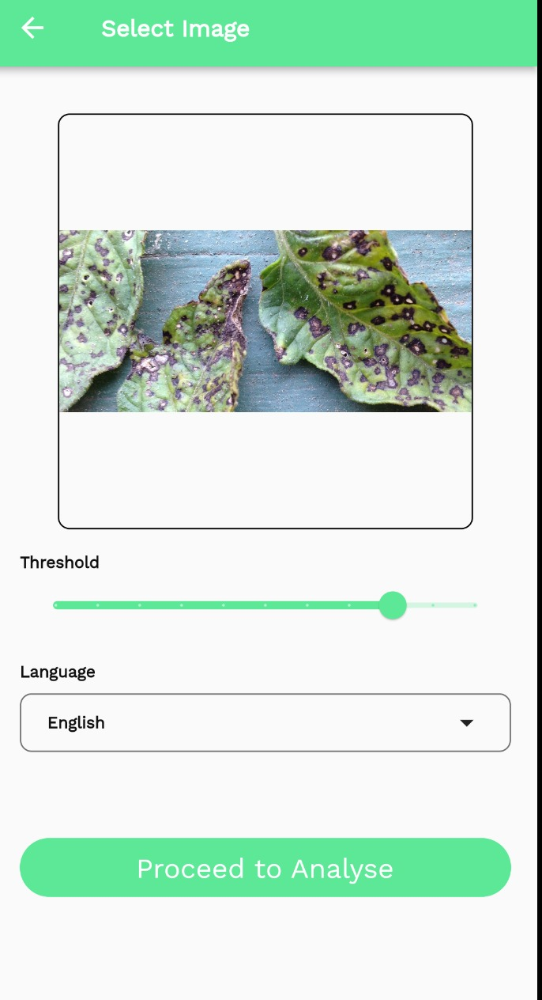
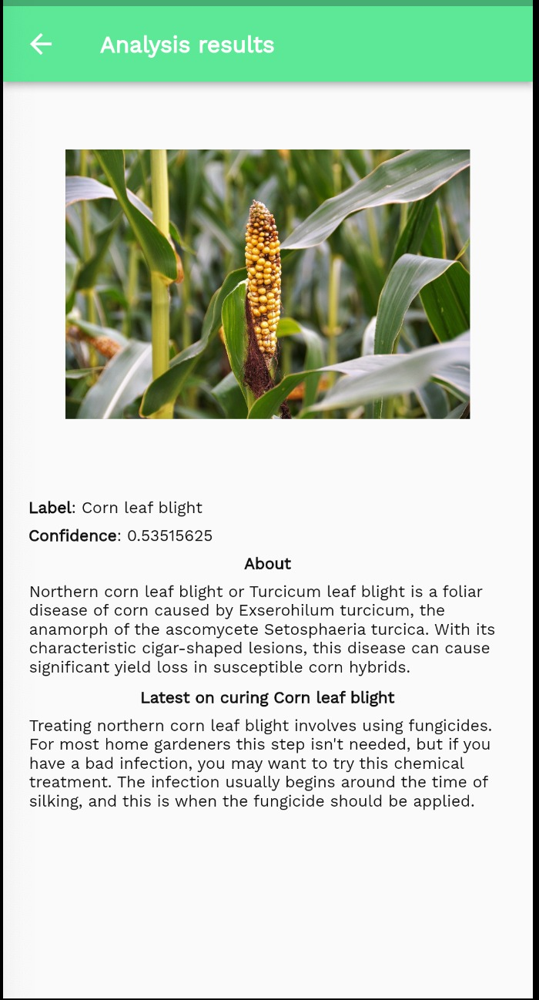

# FarmX Mobile App
_Developed with Flutter and Getx State-Management system._

FarmX is a mobile application that leverages Artificial Intelligence (AI) and Machine Learning (ML) to improve food security and reduce food waste and loss in Sub-Saharan Africa.

## Description
The mobile application is designed to help farmers in Sub-Saharan Africa reduce food waste and loss while promoting sustainable and regenerative agriculture practices. The application leverages AI and ML to provide farmers with tools for detecting crop diseases, recommending the best crops to plant based on their soil composition, and optimizing their farming practices.

## Features
* Crop disease detector - uses AI and ML to identify crop diseases and provides recommended treatments.
* Recommender system - recommends the best crops to plant based on soil composition and promotes sustainable agriculture practices.
* Farm management tools - enables farmers to track their farming activities and optimize their operations.
* Weather forecast - provides farmers with up-to-date weather forecasts to help them plan their farming activities.
* Language translation - bridges the language gap by providing language translation tools for farmers.

## Technologies Used
* Flutter - a mobile app SDK for building high-performance, high-fidelity, apps for iOS, Android, and web.
* TensorFlow - an open-source software library for dataflow and differentiable programming across a range of tasks, including machine learning and deep learning.
* Google Cloud Platform - a suite of cloud computing services that run on the same infrastructure that Google uses internally for its end-user products.
*Google Translate - a machine learning-powered language translation tool that provides accurate and high-quality translations across languages.

## Installation
To install the mobile application, follow these steps:

* Clone the repository to your local machine
* Replace "API-Key" in /env  with your Google Cloud API key... and Enjoy.
* Install the Flutter SDK on your machine.
* Connect your device to your machine and run flutter run in your terminal.

## Contribution Guidelines
Although this project was built for the 2023 Google Solution Challenge, we however welcome contributions from the community. If you have any ideas, suggestions, or bug reports, please open an issue or submit a pull request.

## License
The project is released under the MIT License. See the LICENSE file for more details.

## Credits
This project was developed by Team FarmX for the 2023 Google Solution Challenge. We would like to thank the Google Solution Challenge Organizers for hosting this challenge and for the support throughout the development process.

## Images from the Live Application.

